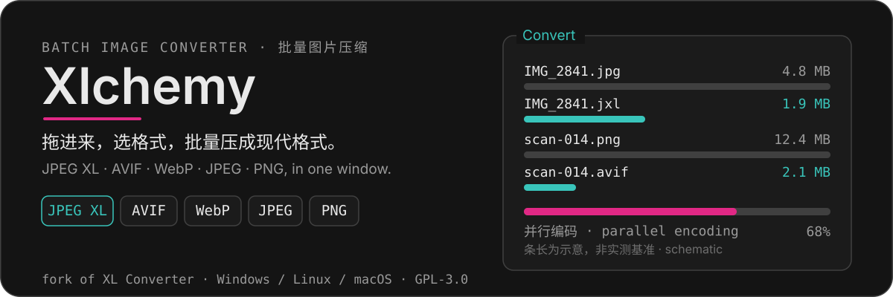
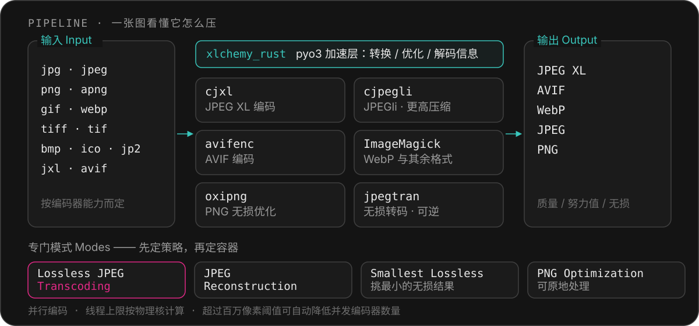

<p align="center">
  
</p>

<p align="center">
  
</p>

<p align="center">
  
  
  
  
  
  
  
  
</p>

<p align="center">
  <b><a href="#中文">中文</a></b> · <b><a href="#english">English</a></b> · <a href="https://xl-docs.codepoems.eu">使用手册 Manual</a>
</p>

---

## 中文

### 这是什么

一个窗口里的批量图片转换器：拖进照片和截图，选一个格式，压成 **JPEG XL / AVIF / WebP / JPEG / PNG**，或者做**可逆的无损瘦身**。它是 [XL Converter](https://github.com/JacobDev1/xl-converter) 的分支，底层调用 `cjxl`、`cjpegli`、`avifenc`、ImageMagick、Oxipng、`jpegtran` 这些真实编码器，而不是自己重写一套。

### 界面


> 这张截图是**上游经典 Qt 壳**（`XLCHEMY_UI=classic`）。本分支默认使用 Fluent 界面壳，见下节。

### 为什么是这个分支

| 分支新增 | 说明 |
| --- | --- |
| **Fluent 界面壳** | 基于 `PySide6-Fluent-Widgets` 的可关闭接缝；Miku / Ralsei / Dark Amber / Light Amber 四套主题，可跟随系统深浅 |
| **经典壳共存** | `ui/fluent/` 是接缝而非替换，`XLCHEMY_UI=classic` 回到与上游逐像素一致的界面 |
| **Rust 加速绑定** | `xlchemy_rust`（pyo3）承担转换、优化与图片信息解码 |
| **macOS 原生包** | `.app` 与 `.dmg`（universal2），含 dylib 装箱脚本与 DMG 背景 |
| **简体中文 UI** | `zh_CN` 语言目录，文案走可校验的 i18n 接缝（`task i18n:check` 报告未翻条目） |
| **工程化入口** | `Taskfile.yml` + [uv](https://docs.astral.sh/uv/)：一条命令建环境、编扩展、跑测试 |

### 它怎么工作

<p align="center">
  
</p>

- **并行编码**：多个编码器同时跑；线程上限按物理核计算，避免大小核机器上的调度退化。
- **内存压力规则**：图片超过设定的百万像素阈值时，把并发编码器数量降到 1 或指定比例，作用域可限定在 JPEG XL / SVT-AV1-PSY。
- **元数据**：通过 ExifTool 搬运 EXIF 与色彩信息。
- **可逆**：无损 JPEG 转码不重编码像素，随时可以还原。

### 功能特性

- **JPEGli 编码** — 生成完全兼容的 JPEG，压缩率最高提升 [35%](https://opensource.googleblog.com/2024/04/introducing-jpegli-new-jpeg-coding-library.html)。
- **现代格式** — JPEG XL 与 AVIF 压得最狠，WebP、JPEG、PNG 同样可用。
- **无损 JPEG 转码** — 体积减小 16%–22%，过程可逆。
- **缩放** — 按分辨率、百分比、短边/长边、百万像素四种口径缩小。
- **PNG 优化模式** — 交给 Oxipng 做无损优化，强度可调，可原地处理。
- **专门模式** — 除按格式转换外，还有 Lossless JPEG Transcoding、JPEG Reconstruction 与 Smallest Lossless（在 PNG / WebP / JPEG XL 里挑最小的无损结果）。
- **进程优先级** — 转换时可以主动让出 CPU。
- **预设与冲突策略** — 保存常用配置；重名文件按策略处理，可选删除原件（进回收站）。

### 支持的格式

输入按编码器能力而定：

| 编码器 | 可用输入 |
| --- | --- |
| `cjxl`（JPEG XL） | jpg/jpeg/jfif/jif/jpe · png · apng · gif · jxl |
| `cjpegli`（JPEGli） | jpg/jpeg/jfif/jif/jpe · png |
| `avifenc`（AVIF） | jpg/jpeg/jfif/jif/jpe · png |
| ImageMagick（WebP 等） | jpg/jpeg/jfif/jif/jpe · png · gif · webp · jp2 · bmp · ico · tiff/tif |
| `oxipng`（PNG 优化） | png |
| `jpegtran`（无损转码） | jpg/jpeg/jfif/jif/jpe |

输出：**JPEG XL · AVIF · WebP · JPEG · PNG**。

### 快速开始

推荐用 `task`（[Taskfile](https://taskfile.dev)）+ [uv](https://docs.astral.sh/uv/)：建好 Python 3.12 虚拟环境、装依赖、编 Rust 扩展、自检。

```bash
git clone https://github.com/HibernalGlow/Xlchemy.git
cd Xlchemy
task setup   # 建环境 → 装依赖 → 编译 Rust 扩展 → 自检
task run     # 启动应用
```

```bash
task run:zh  # 以简体中文启动（不改持久设置）
task run:en  # 以英文启动
task test    # 全部单测；透传 pytest 参数：task test -- -k theme
```

> [!NOTE]
> 外部编码器（`cjxl` / `avifenc` / `cjpegli` / ImageMagick / Oxipng / ExifTool）需要单独编译，跑 `make deps`；打包产物已内置这些工具。

### 开发

| 任务 | 作用 |
| --- | --- |
| `task env:check` | 打印真正生效的解释器、Qt、Fluent 组件与 Rust 扩展路径 |
| `task rust` | 改动 `rust_bindings/` 后重编扩展 |
| `task i18n` / `task i18n:check` | 刷新原文清单 / 报告还有多少文案没翻 |
| `task test:ui` / `task test:i18n` / `task test:cov` | 界面测试 / i18n 接缝回归 / 覆盖率 |
| `task test:convert` | 功能测试，走真实转码，较慢 |
| `task test:gil` | GIL 释放测试 |
| `task build` / `task build:dmg` | 打包 `.app` / `.dmg`（后者仅 macOS） |
| `task build:portable` | 便携包（Windows 7z / Linux sh） |
| `task clean` | 清理打包产物 |

依赖一律走 uv 而不是 pip：pip 替换旧版本时会递归删目录，在受限环境下容易留下装了一半的 `site-packages`。国内网络可临时换源：

```bash
UV_INDEX_URL=https://pypi.tuna.tsinghua.edu.cn/simple task env:deps
```

### 环境变量

| 变量 | 作用 |
| --- | --- |
| `XLCHEMY_LANG` | `zh_CN` 或 `en`，只影响本次启动的语言 |
| `XLCHEMY_UI` | 设为 `classic` 切回上游的经典 Qt 壳，不使用 Fluent 界面 |

<details>
<summary><b>从源码构建（Windows / Linux / macOS 完整步骤）</b></summary>

> [!NOTE]
> 日常使用请直接下载发行版，完整构建相当耗时。

#### macOS

```bash
make deps              # 编译外部编码器与 ExifTool（PLAT 会按宿主系统自动选择）
task build             # .app
task build:dmg         # .dmg（universal2）
```

#### Windows 10/11

前置条件：
- [Python 3.13](https://python.org/downloads/)（勾选 `Add python.exe to PATH`）
- [git](https://git-scm.com/)
- [MSYS2](https://msys2.org/)
- Visual Studio 2022（含 Windows 10 或 11 SDK）
- 最新 [vc_redist](https://aka.ms/vs/17/release/vc_redist.x64.exe)

启动 MSYS2 MINGW64 并执行：

```bash
pacman -Syu
```

若 MSYS2 要求重启，同意后重新启动它。安装依赖包：

```bash
pacman -S --needed \
    git \
    cmake \
    wget \
    make \
    base-devel \
    autoconf \
    automake \
    libtool \
    nasm \
    mingw-w64-x86_64-gcc \
    mingw-w64-x86_64-toolchain \
    mingw-w64-x86_64-cmake \
    mingw-w64-x86_64-ninja \
    mingw-w64-x86_64-gtest \
    mingw-w64-x86_64-giflib \
    mingw-w64-x86_64-libpng \
    mingw-w64-x86_64-libjpeg-turbo \
    mingw-w64-x86_64-rust \
    mingw-w64-x86_64-7zip \
    mingw-w64-x86_64-imagemagick \
    mingw-w64-x86_64-libjxl \
    mingw-w64-x86_64-aom
```

再次重启 MSYS2 MINGW64。

> [!IMPORTANT]
> 只要安装或升级过任何包，就必须重启 MSYS2 环境，否则构建会以随机的原因失败。

逐个目标编译（每个目标还有各自的额外要求）：
`make libjpeg-turbo` · `make libavif` · `make imagemagick` · `make libjxl` · `make oxipng` · `make exiftool`

打开 CMD，进入项目目录并建立虚拟环境：

```cmd
cd C:\msys64\home\user\Xlchemy
python -m venv env_build
env_build\Scripts\activate
pip install -r requirements.txt
```

运行程序 `python main.py`。打包：

```cmd
cd C:\msys64\home\user\Xlchemy
call misc\build_scripts\windows\pyinstaller.cmd
env_build\Scripts\activate
python build.py
```

倒数第二行重新加载环境，用于避免 `ModuleNotFoundError`。

#### Linux（Ubuntu 系）

前置条件：
- Docker（配置成无需 root 即可运行）
- [pyenv](https://github.com/pyenv/pyenv)（[写进 shell](https://github.com/pyenv/pyenv?tab=readme-ov-file#set-up-your-shell-environment-for-pyenv)）

```bash
sudo apt update
sudo apt install git make curl fuse p7zip-full
```

安装 [xcb QPA](https://doc.qt.io/qt-6/linux-requirements.html) 依赖：

```bash
sudo apt install '^libxcb.*-dev' libfontconfig1-dev libfreetype6-dev libx11-dev libx11-xcb-dev libxext-dev libxfixes-dev libglu1-mesa-dev libxrender-dev libxi-dev libxkbcommon-dev libxkbcommon-x11-dev
```

安装 Python 构建依赖：

```bash
sudo apt install wget build-essential libreadline-dev libncursesw5-dev libssl-dev libsqlite3-dev tk-dev libgdbm-dev libc6-dev libbz2-dev libffi-dev zlib1g-dev liblzma-dev
```

编译并设置 Python `3.13`：

```bash
pyenv install 3.13
pyenv global 3.13
```

克隆仓库、编译依赖、建环境并运行：

```bash
git clone -b stable --depth 1 https://github.com/HibernalGlow/Xlchemy.git
cd Xlchemy
make deps
python -m venv env_build
source env_build/bin/activate
pip install -r requirements.txt
python main.py
```

打包：

```bash
./misc/build_scripts/linux/pyinstaller.sh
source env_build/bin/activate   # 重新加载环境，避免 ModuleNotFoundError
python build.py
```

</details>

<details>
<summary><b>测试 Testing</b></summary>

```bash
python test.py            # 单元测试，python test.py --help 可控范围
python test_convert.py    # 功能测试：校验真实产出（Windows）
```

Linux 下功能测试需要 `xvfb`：

```bash
sudo apt install xvfb
make test-convert
```

</details>

### 许可与致谢

- 应用本体：GNU General Public License v3，继承上游 [XL Converter](https://github.com/JacobDev1/xl-converter) 的许可，见 [LICENSE.txt](LICENSE.txt)。
- 第三方组件清单见 [LICENSE_3RD_PARTY.txt](LICENSE_3RD_PARTY.txt)（libjxl、libavif、AOM、SVT-AV1-PSY、ImageMagick、OxiPNG、ExifTool、PySide6 等）。
- 感谢 Code Poems 与所有上游贡献者，以及 [libjxl](https://github.com/libjxl/libjxl)、[libavif](https://github.com/AOMediaCodec/libavif)、AOM、OxiPNG、ExifTool、ImageMagick 的维护者。

贡献前请阅读 [CONTRIBUTING.md](.github/CONTRIBUTING.md)。

---

## English

A batch image converter in one window: drop in photos and screenshots, pick a format, and get **JPEG XL / AVIF / WebP / JPEG / PNG** — or a **reversible lossless** shrink. It drives the real encoders (`cjxl`, `cjpegli`, `avifenc`, ImageMagick, Oxipng, `jpegtran`) instead of reimplementing them, and it is a fork of [XL Converter](https://github.com/JacobDev1/xl-converter) based on upstream `stable` **v1.3.0**.

### What the fork adds

| Addition | Detail |
| --- | --- |
| **Fluent UI shell** | A closable seam on `PySide6-Fluent-Widgets`; Miku / Ralsei / Dark Amber / Light Amber themes plus an optional follow-system light/dark switch |
| **Classic shell kept** | `XLCHEMY_UI=classic` restores the upstream interface shown in the screenshot above |
| **Rust bindings** | `xlchemy_rust` (pyo3) handles conversion, optimization and image-info decoding |
| **macOS builds** | `.app` and universal2 `.dmg`, with dylib staging scripts |
| **Simplified Chinese UI** | `zh_CN` catalog behind a verifiable i18n seam (`task i18n:check`) |
| **Taskfile + uv workflow** | One command to create the environment, build the extension and run tests |

### Mechanism

The pipeline diagram above is the short version: encoders run in parallel with thread caps derived from **physical** cores; a memory-pressure rule can drop concurrent encoders to 1 or a chosen fraction once an image exceeds a megapixel threshold; ExifTool carries metadata across; and lossless JPEG transcoding re-quantizes no pixels, so it stays reversible.

### Features

- **JPEGli** — fully compatible JPEGs with up to [35% better compression ratio](https://opensource.googleblog.com/2024/04/introducing-jpegli-new-jpeg-coding-library.html).
- **Modern formats** — JPEG XL and AVIF for the deepest cuts; WebP, JPEG and PNG also supported.
- **Lossless JPEG transcoding** — 16%–22% smaller, reversible.
- **Downscaling** — by resolution, percent, shortest/longest side, or megapixels.
- **PNG optimization mode** — lossless Oxipng pass, adjustable effort, in-place option.
- **Specialized modes** — Lossless JPEG Transcoding, JPEG Reconstruction, Smallest Lossless (picks the smallest lossless result among PNG / WebP / JPEG XL).
- **Process priority, presets, conflict policies** — yield CPU, save settings, handle name collisions, optionally move originals to trash.

Input acceptance per encoder is in [支持的格式](#支持的格式).

### Quick start

```bash
git clone https://github.com/HibernalGlow/Xlchemy.git
cd Xlchemy
task setup   # environment → dependencies → Rust extension → self-check
task run     # launch
task test    # unit tests; pass through args: task test -- -k theme
```

External encoders are compiled separately with `make deps`; bundled releases ship them. Full Windows, Linux and macOS source-build steps and the test commands are in the collapsible sections above.

### License

GNU General Public License v3, inherited from upstream XL Converter — see [LICENSE.txt](LICENSE.txt). Third-party notices live in [LICENSE_3RD_PARTY.txt](LICENSE_3RD_PARTY.txt). Please read [CONTRIBUTING.md](.github/CONTRIBUTING.md) before opening issues or pull requests.
